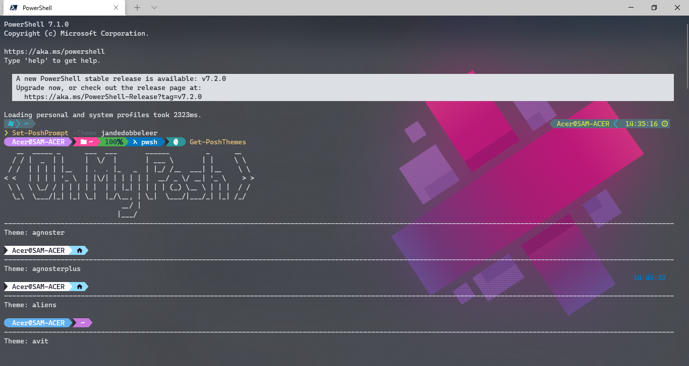
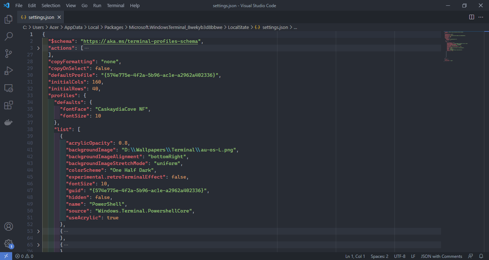

# PowerShell and Oh-My-Posh

- Download dan Install PowerShell Core
  https://aka.ms/pscore6 atau https://aka.ms/PowerShell-Release?tag=v7.1.2 (langsung)

- Install PowerShell plugin

  - Tekan [`windows key` + `r`] atau cari program `run`, lalu ketik `pwsh`, lalu tekan [`crtl` + `shift` + `enter`] (administrator mode) (gak pake admin pun tak apa sih)
  - Install module untuk powershell, disarankan mengunakan `-Score CurrentUser` (saya pernah pake `-Score AllUsers`, ternyata ada conflict antar file, klo mau coba yah silahkan saja)
    ```
    Install-Module -Name Terminal-Icons -Scope CurrentUser
    Install-Module -Name oh-my-posh -Scope CurrentUser
    Install-Module -Name posh-git -Scope CurrentUser
    Install-Module -Name PSReadLine -AllowPrerelease -Scope CurrentUser -Force -SkipPublisherCheck
    ```
    copy-paste perintah di atas ke powershell
  - Ganti profile powershell, ketik `notepad $PROFILE` lalu `enter` (ketahui `terminal tab completion`) (ex: ketik `$pro` lalu tekan `tab` otomatis ada sugestinya)

    ```
    Import-Module Terminal-Icons
    Import-Module posh-git
    Import-Module oh-my-posh

    Set-PSReadLineOption -PredictionSource History

    Set-PoshPrompt -Theme night-owl
    # Set-PoshPrompt -Theme jandedobbeleer # rekomendasi om-my-posh
    # ketik Get-PoshThemes di powershell untuk melihat list tema yang tersedia
    ```

    copy-paste script di atas lalu save

---

# Terminal

- Download Windows Terminal di Microsoft Store

- Download Fonts

  - https://github.com/microsoft/cascadia-code/releases (gak usah juga gak apa-apa, gak ada glyphs atau icon-iconnya gitu)
  - https://github.com/adam7/delugia-code/releases (delugia-complete, ini saja sudah cukup)
  - https://github.com/ryanoasis/nerd-fonts/releases (download yang `Meslo.zip`, rekomendasi dari oh-my-posh)
  - https://www.nerdfonts.com/ (cek aja sendiri bila ingin tahu soal font yang punya icon indah)

- Cara membuka Windows Terminal

  - [`windows key` + `r`] `=>` ketik `wt` atau `wt -M` (untuk maximize) `=>` tekan `enter`

    

- Cara ganti font di Windows Terminal

  - Masuk Setting (`ctrl` + `,`) (`control` dan `comma`) `=>` Open JSON File

  - dibagian `profiles` -> `defaults`, tambah `"fontFace": "Delugia"` dan `"fontSize": 10`
    ```json
    {
      "defaults": {
        "acrylicOpacity": 0.8,
        "font": {
          "face": "Delugia",
          "size": 10
        },
        "useAcrylic": true
      }
    }
    ```

  

  Saya menggunakan `CaskaydiaCove NF` daripada `Delugia` karena iconnya terlihat lebih besar

---

# Extra

- https://terminalsplash.com/

- https://dev.to/anupa/beautify-your-windows-terminal-1la8
